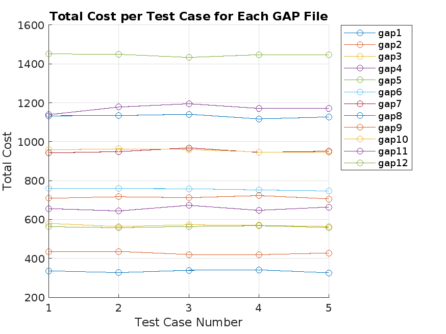

# GAP Solver Using `intlinprog` in MATLAB

## 📌 Overview

This project implements a solver for the **Generalized Assignment Problem (GAP)** using MATLAB’s `intlinprog` function for integer linear programming. The GAP involves assigning users (jobs) to servers (agents) in a way that **minimizes total cost**, while ensuring that the resource capacities of the servers are not exceeded.

The solution runs across **12 standard GAP datasets**, analyzes multiple test cases from each, and compiles the total cost results for comparison.

---

## 📂 Files Included

| File Name                      | Description                                                                 |
|-------------------------------|-----------------------------------------------------------------------------|
| `spp_using_intlinprog.m`      | MATLAB script that reads GAP datasets, solves them, saves results, and plots a graph |
| `gap_results_horizontal.csv`  | Output file storing the total costs for each test case across all 12 GAP files |
| `gap_results_plot.png`        | Line plot visualizing total cost trends across test cases for all GAP datasets |

---

## 🧠 Key Features

- Reads 12 input GAP dataset files: `gap1.txt` to `gap12.txt`
- Solves each test case using a linear integer solver (`intlinprog`)
- Outputs a CSV containing the results in horizontal (tabular) format
- Generates a line plot for total cost comparison across test cases and files

---

## 🛠️ How to Use

### 1. Place Required Files

Ensure the following are in the correct paths:
- GAP input files: `gap1.txt` to `gap12.txt`
- These should be located in:  
  `/MATLAB Drive/Assignments/Gap Dataset Files/`

### 2. Run the Script

Open MATLAB and execute the function:

```matlab
spp_using_intlinprog()
```

This will:
- Solve all test cases across all files
- Save results as `gap_results_horizontal.csv` at  
  `/MATLAB Drive/Assignments/Assignment 1/`
- Generate and save a plot as `gap_results_plot.png` in the same folder

---

## 📊 Output Summary

The generated **line plot** (`gap_results_plot.png`) visualizes total costs for each test case (1 to 5) across all GAP datasets (`gap1` to `gap12`).

Each line represents a GAP file, helping you compare their performance visually in terms of cost minimization.



---

## 🧮 Optimization Model

The GAP is formulated as an Integer Linear Programming (ILP) problem. For each test case:

- **Objective:** Minimize total cost of assignment
- **Constraints:**
  - Each job is assigned to exactly one agent
  - Server capacities are not exceeded
  - Assignments are binary (0 or 1)

The solver used is `intlinprog`, MATLAB’s built-in integer linear programming tool.

---

## 📧 Contact

For questions or contributions, feel free to reach out or fork the repository.